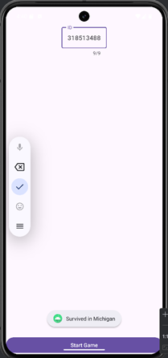

# SurviveGame

•	חילצתי את הקבצים הנחוצים מהAPK לתוך פרויקט חדש בAndroid Studio.

•	תיקנתי הערות קומפילציה בקובץ  Activity_Game, הייתי צריך לחליף את הפרמטר בפונקציה של הToast ממספר קבוע למשתנה Toast.LENGTH_LONG

•	הרצתי את התוכנית, והזנתי ת.ז, התוכנית קרסה.

•	הסתכלתי בלוגים איפה התוכנית קרסה וראיתי שהיה חריגה של OutOfBounds.

•	הבנתי שהמידע שמגיע לפונצקיה לא מגיע כמו שצריך, כי שהוספתי לוגים לid ולdata, אז data היה ריק.

•	ראיתי שהdata מגיע מurl מסויים, וכשראיתי את הurl, הופיעו בו תווים בלתי נראים, הורדתי אותם ואז הurl עבד.

•	כשפתחתי את הurl הזה בדפדפן, קיבלתי רשימה של מדינות בארה"ב.

•	הרצתי את התוכנית שוב ואחרי שהזנתי ת.ז הועברתי לעמוד עם חיצים.

•	לחצתי על החיצים בצורה אקראית עד שקיבלתי הודעה “you failed”.

•	הבנתי שמספר הפעמים שיש ללחוץ על החיצים הוא 9, כי לאחר שלחצתי 9 פעמים רצוף על כל כיוון, קיבלתי את ההודעה של “you failed”.

•	לפי הלוגיקה של הקוד, אני מבין שכל המספרים של הת.ז שאני מזין הופכים להיות 0-3 לפי מודולו 4.

•	אם 0: שמאל, 1: ימין, 2: למעלה, 3:למטה, אז צריך לחשב את החיצים שצריך ללחוץ עליהם בהתאם.

•	הת.ז שלי הוא 318513488, לכן הסדרה הנכונה צריכה להיות:
למטה, ימינה, שמאלה, ימינה, ימינה, למטה, שמאלה, שמאלה, שמאלה

•	הוספתי ולידציה לקלט של הת.ז כך שהיא חייבת להיות באורך 9 ספררות

